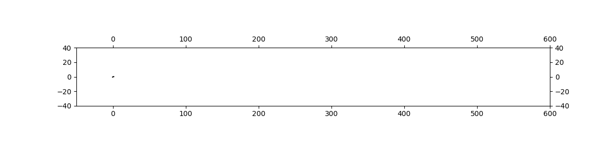

# Handwritten LaTeX Synthesis

This project implements a deep learning model to generate synthetic handwriting for LaTeX mathematical formulas. It is based on the sequence-to-sequence model described in Alex Graves' paper, "Generating Sequences With Recurrent Neural Networks," and heavily adapted from the [handwriting-synthesis](https://github.com/sjvasquez/handwriting-synthesis) project by Sean Vasquez.

This implementation has been modernized to use TensorFlow 2.x and Keras, and specifically adapted to train on the [MathWriting 2024](https://zenodo.org/records/10602325) dataset of handwritten LaTeX symbols.



## Project Structure

- `train_latex.py`: The main script for training the handwriting synthesis model.
- `generate.py`: A script to generate handwriting samples from a trained model.
- `prepare_latex_data.py`: A utility to process the raw InkML data into NumPy arrays for training.
- `tf2_rnn_cell.py`: Defines the custom Keras-compatible RNN cell with an attention mechanism, which is the core of the model.
- `inkml2img.py`: A utility script to visualize InkML files by converting them to PNG images.
- `handwriting-synthesis-master/`: A copy of the original project files, used for some helper functions (e.g., `drawing.py`).
- `mathwriting-2024-excerpt/`: A subset of the dataset used for training.
- `data/processed_latex/`: The output directory for the processed data.
- `tf_ckpts/`: The directory where model checkpoints are saved during training.

## Setup

### Dependencies

This project is built with Python 3.9+ and TensorFlow 2.x.

1.  **Create a virtual environment:**
    ```bash
    python3 -m venv venv
    source venv/bin/activate
    ```

2.  **Install dependencies:**
    A `requirements.txt` is provided in the original `handwriting-synthesis-master` directory. You can install it, but you will need to add TensorFlow and other libraries. A recommended list is:
    ```bash
    pip install tensorflow numpy matplotlib tqdm scikit-image
    ```

3.  **For macOS Users (Apple Silicon):**
    To enable GPU acceleration, install the `tensorflow-metal` plugin:
    ```bash
    pip install tensorflow-metal
    ```
    The training script is already configured to enable memory growth for the GPU, which helps prevent crashes.

## Usage Pipeline

### Step 1: Data Setup

1.  **Download the data:** This repository includes an excerpt of the MathWriting 2024 dataset. For a full training, download the complete dataset from the official source and place it in the project root.
2.  The data is expected to be in a directory structure that includes a `symbols.jsonl` file for labels and a `symbols/` directory with the `.inkml` files.

### Step 2: Prepare the Data

Run the `prepare_latex_data.py` script to convert the raw InkML and label data into processed NumPy arrays.

```bash
python prepare_latex_data.py
```

This script will:
- Read the labels from `mathwriting-2024-excerpt/symbols.jsonl`.
- Create a `char_map.json` file, which maps every character in the dataset to an integer.
- Process every `.inkml` file, converting the strokes into a normalized sequence of offsets.
- Save the final data as four `.npy` files (`x.npy`, `x_len.npy`, `c.npy`, `c_len.npy`) in the `data/processed_latex/` directory.

You can customize the input and output directories using command-line arguments:
```bash
python prepare_latex_data.py --data_dir /path/to/your/data --output_dir /path/to/processed
```

### Step 3: Train the Model

Once the data is prepared, you can start training the model by running `train_latex.py`.

```bash
python train_latex.py
```

- The script will load the processed data from `data/processed_latex/`.
- It will initialize the `HandwritingRNN` model.
- Training progress (loss) will be printed to the console.
- Model checkpoints will be saved periodically to the `tf_ckpts/` directory.
- At the end of training, the final model weights will be saved to `handwriting_model.weights.h5`.

You can modify hyperparameters like batch size, learning rate, and number of training steps directly within the script via command-line arguments. For example:
```bash
python train_latex.py --batch_size 64 --learning_rate 0.00005 --num_training_steps 20000
```

### Step 4: Generate Handwriting

After training, you can generate a sample with `generate.py`.

```bash
python generate.py "1 + 1 = 2"
```

This will:
- Load the trained model weights from `handwriting_model.weights.h5`.
- Generate the handwriting for the text "1 + 1 = 2".
- Save the output image as `generated_sample.png`.

You can specify the output file and the model to use:
```bash
python generate.py "\\frac{a}{b}" --output_path "fraction.png" --model_weights "/path/to/your/weights.h5"
```

## Credits

- This project is a direct modernization of the work done by **Sean Vasquez** in his [handwriting-synthesis](https://github.com/sjvasquez/handwriting-synthesis) repository. The core data processing logic in `drawing.py` and the model architecture are derived from his implementation.
- The model itself is based on the paper "Generating Sequences With Recurrent Neural Networks" by **Alex Graves**.
- The dataset used is the **MathWriting 2024** dataset.

